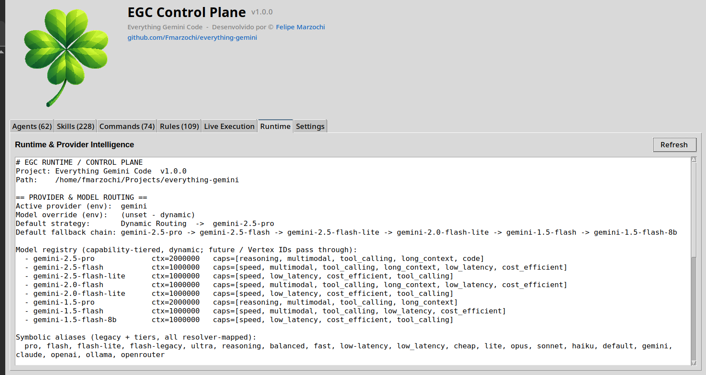

<!-- LANGUAGE-SELECTOR-START -->
🌐 [English](../../README.md) · [العربية](../ar/README.md) · [Español](../es/README.md) · **हिन्दी** · [日本語](../ja/README.md) · [한국어](../ko/README.md) · [Português (Brasil)](../pt/README.md) · [Русский](../ru/README.md)
<!-- LANGUAGE-SELECTOR-END -->

<div align="center">

</div>

[](https://securityscorecards.dev/viewer/?uri=github.com/Fmarzochi/EGC) [](https://sonarcloud.io/project/overview?id=Fmarzochi_EGC) [](https://sonarcloud.io/project/overview?id=Fmarzochi_EGC) [](https://sonarcloud.io/project/overview?id=Fmarzochi_EGC) [](https://socket.dev/npm/package/@egchq/egc) [](https://glama.ai/mcp/servers/Fmarzochi/EGC)

<div align="center">

# EGC - Extended Global Context

**आपके AI एजेंट अब फिर कभी शून्य से शुरू नहीं होंगे।**

*कोई सेटअप नहीं। कोई कमांड नहीं। आप काम करें, EGC याद रखेगा।*

</div>

---

EGC एक स्थानीय रनटाइम (runtime) है जो आपके द्वारा उपयोग किए जाने वाले हर AI कोडिंग टूल को एक स्थायी मेमोरी देता है। प्रत्येक सत्र (session) के अंत में, AI आपके प्रोजेक्ट के बारे में जो कुछ भी सीखता है उसे सहेजता है: आपके द्वारा लिए गए निर्णय, क्या विफल रहा, आपकी प्राथमिकताएं, और आगे क्या करना है। अगले सत्र की शुरुआत में, यह उस स्थिति (state) को बिना पूछे अपने आप वापस लोड करता है। किसी भी भाषा में "चलो जारी रखते हैं" या "हम कहाँ रुके थे?" कहें, और आपका AI पहले से जानता है कि क्या करना है। एक सिंगल इंस्टॉलेशन Claude Code, Cursor, Gemini CLI, Windsurf, Zed, Warp, VS Code with GitHub Copilot, और बहुत कुछ को कवर करता है (कुल 19 टूल्स)। यह मूल रूप से Claude, GPT-4o, Gemini, DeepSeek, Mistral, Groq, Cohere, और Vertex AI के साथ काम करता है, साथ ही Qwen3, Llama 4 और अन्य के लिए OpenRouter भी।

---

## आपका AI पहले से जानता है

आप Claude Code को एक ऐसे प्रोजेक्ट पर खोलते हैं जिसे आपने दो सप्ताह से नहीं छुआ है। बिना कुछ टाइप किए:

```
State loaded from egc-memory via ~/.egc/state/MyApp/main.md

Context and preferences acknowledged.

Ready to pick up:
• Fix the rate limiter edge case on concurrent requests
• Add integration tests for the new auth module
• Review open PR from @contributor before merging

=== EGC Stack Briefing ===
Stack: typescript, node
Skills: tdd-workflow, coding-standards
Agents: code-reviewer
Guardian: active, every command checked before it runs
===
```

यह आपकी पिछली बातचीत का कैश नहीं है। EGC निर्णयों, बंद गलियों और आपकी प्राथमिकताओं को याद रखता है, और पूरे सत्र के दौरान पहरा देता है, उन कमांड को निष्पादन से पहले रोकता है जो आपके कोडबेस को नुकसान पहुंचा सकते हैं। आपने कुछ भी नहीं मांगा। आपने बस काम शुरू कर दिया।

<div align="center">
  
</div>

---

## इंस्टॉल करें

Windows, macOS, और Linux पर एक ही इंस्टॉल कमांड:

```bash
npm install -g @egchq/egc && egc install
```

Windows के अपने कुछ खास मामले हैं (PowerShell वर्शन, Antigravity CLI, Gemini CLI का बंद हो चुका free tier): अगर कुछ अप्रत्याशित हो तो [Windows notes](../../docs/installation.md#windows-notes) देखें।

या बिना वैश्विक स्तर पर इंस्टॉल किए चलाएं:

```bash
npx @egchq/egc install
```

**एक दिमाग, कई टूल।** GitHub Copilot Chat एक्सटेंशन इंस्टॉल होने पर, Copilot अपने आप skills ढूंढ लेता है, और वही मेमोरी जो आपके पास पहले से Claude Code या Cursor में है, वहां भी दिखाई देती है:

```bash
npm install -g @egchq/egc
egc install --target copilot
```

[पूर्ण इंस्टॉलेशन गाइड](../../docs/installation.md)

---

## EGC आपके AI को क्या देता है

EGC हर सत्र में हमेशा दो चीज़ें एक साथ चलाता है: एक मेमोरी जो जो ज़रूरी है उसे संभाल कर रखती है, और एक सुरक्षा परत जो खतरनाक कमांड को निष्पादन से पहले रोकती है। सब कुछ पहले से तैयार है, कोई कॉन्फ़िगरेशन ज़रूरी नहीं।

### मेमोरी: आपका AI खुद क्या याद रखता है

आपको कभी कोई कमांड याद नहीं करना पड़ेगा। किसी भी भाषा में कहें: "कल से जारी रखो", "यह निर्णय याद रखो", "पिछली बार क्या टूटा था" और आपका AI बिल्कुल जानता है कि क्या करना है। काम आपका है, याद रखना EGC का।

**`egc-memory`**

| टूल | यह क्या करता है |
|---|---|
| `get_state` | सत्र खुलते ही आपके AI को प्रोजेक्ट के बारे में जो कुछ भी पहले से पता था, वह सब लोड कर देता है |
| `update_state` | आज जो तय हुआ उसे सहेजता है, ताकि कल कोई भी सिलसिला न खोए |
| `store_decision` | एक महत्वपूर्ण निर्णय को हमेशा के लिए दर्ज करता है |
| `query_history` | पिछले निर्णयों को उसी क्रम में दिखाता है जिसमें वे हुए थे |
| `search_history` | कोई भी निर्णय ढूंढ लेता है, भले ही आपको तारीख याद न हो |
| `working_memory_set` / `_get` / `_list` | तेज़ नोट्स जो ज़रूरत खत्म होते ही खुद-ब-खुद मिट जाते हैं |
| `lesson_save` | सीखी हुई बात दर्ज करता है, जो समय के साथ कमज़ोर होती जाती है अगर कोई इसे दोबारा पुष्टि न करे |
| `lesson_recall` | अब भी काम के सबक वापस लाता है |
| `lesson_reinforce` | जब कोई सबक दोबारा सही साबित होता है, तो उसका भरोसा बढ़ाता है |
| `detect_patterns` | जब एक ही गलती या कमांड बार-बार होती है, तो इसे पहचान लेता है |
| `compress_observations` | कच्चे इतिहास को संक्षेप में समेटता है ताकि टोकन बेकार न हों |
| `get_project_state` | जांचता है कि मेमोरी सही तरीके से काम कर रही है |

आपके प्रोजेक्ट की हर branch की अपनी अलग मेमोरी होती है, आपके कंप्यूटर पर एन्क्रिप्टेड। इसे किसी और की, यहां तक कि क्लाउड की भी, पहुंच नहीं है। शुरू से ही प्राइवेसी, कुछ भी सेट किए बिना।

### संदर्भ और सुरक्षा: काम के दौरान पहरा देने वाला

**`egc-guardian`**

ये टूल पृष्ठभूमि में स्वचालित रूप से चलते हैं। हर shell कमांड और हर फाइल राइट को निष्पादन से पहले जांचा जाता है। आपको इन्हें सीधे कॉल करने की आवश्यकता नहीं है।

| टूल | यह क्या करता है |
|---|---|
| `validate_command` | हर कमांड को निष्पादन से पहले जांचता है: जो नुकसान पहुंचा सकते हैं उन्हें रोकता है |
| `validate_write` | AI को गलती से संवेदनशील फाइलों में लिखने से रोकता है |
| `reduce_context` | बड़ी फाइलों को छोटा करता है ताकि आपका टोकन बजट बेकार न जाए |
| `orchestrate_task` | हर अनुरोध के लिए सही टूल चुनता है, बिना आपको यह जानने की ज़रूरत के कि कौन-कौन से टूल मौजूद हैं |
| `auto_learn` | सत्र की गलतियों से सीखता है और उसे दर्ज कर लेता है ताकि वह दोबारा न हो |

### Token Crusher: शेल के शोर पर टोकन जलाना बंद करें

200 कमिट वाला `git log`, 400 लाइनों वाला `npm install`, 300 पास होते टेस्ट वाली सुइट: आपका मॉडल यह सब पढ़ता है, और आप इस सबका भुगतान करते हैं। Token Crusher इस आउटपुट को **मॉडल तक पहुंचने से पहले** संकुचित करता है: 90% तक छोटा, जबकि त्रुटियां, चेतावनियां और विफलताएं हमेशा सुरक्षित रहती हैं।

```
egc run git log        # वही कमांड, संकुचित आउटपुट
egc run --raw git log  # बचाव का रास्ता: पूरा आउटपुट
egc saved              # संचित बचत, शून्य टोकन लागत पर स्थानीय रूप से गणना
```

डिज़ाइन से ही सतर्क: छोटे आउटपुट अछूते गुजरते हैं, विफलताएं हमेशा बचती हैं, और बचत रिपोर्ट आपकी कॉन्टेक्स्ट विंडो को कभी नहीं छूती।
### कोड से लागू, अनुरोध से नहीं

एक ऐसी सुरक्षा जो AI के मूड पर निर्भर नहीं करती: हर कमांड निष्पादन से पहले हमेशा EGC से होकर गुज़रता है। [harness enforcement, सत्र इरादे की पहचान, और memory miner के बारे में पूरी जानकारी →](../../docs/installation.md#enforcement)

### एक मेमोरी। आपके सभी टूल में।

**`egc watch`** को एक बार चलाएं और भूल जाएं। Cursor में संदर्भ बदलें, और यह अपने आप Gemini CLI, Copilot, Windsurf, Zed में दिखाई देता है: जो भी आप इस्तेमाल करते हैं, वहां। कोई मैन्युअल कदम नहीं, कहीं भी पुरानी स्थिति नहीं।

```
egc watch              # वर्तमान प्रोजेक्ट की निगरानी करें
egc watch /path/proj   # किसी विशिष्ट प्रोजेक्ट की निगरानी करें
egc watch --quiet      # आउटपुट दबाएं
```

### डैशबोर्ड: अपने एजेंट्स को काम करते हुए देखें

अपने एजेंटों की हर टूल कॉल, टोकन और लागत ब्राउज़र में लाइव देखें। `egc init` के बाद स्वचालित रूप से शुरू होता है। [पूरी गाइड](../../docs/installation.md#dashboard)

---

## प्रॉम्प्ट लाइब्रेरी

बोनस के तौर पर, EGC आपको 63 agent, 230 skill, और 77 command, साथ ही 111 rule तक पहुंच भी देता है: विशेषज्ञ जो खुद आपके कोड की समीक्षा करते हैं, हर भाषा और स्थिति के लिए सर्वोत्तम अभ्यास गाइड, शॉर्टकट जो पूरा कार्यों का सिलसिला आपके लिए चला देते हैं, और स्टाइल नियम जो आपके कोड को एक जैसा बनाए रखते हैं। सब कुछ असली इंजीनियरिंग सत्रों से लिखा गया है, सिद्धांत से नहीं। इनमें से कुछ भी इस्तेमाल नहीं करना चाहते? कोई बात नहीं: EGC की स्थायी मेमोरी वैसे भी बिल्कुल वैसे ही काम करती है।

---

🌐 [English](../../README.md) · [العربية](../ar/README.md) · [Español](../es/README.md) · **हिन्दी** · [日本語](../ja/README.md) · [한국어](../ko/README.md) · [Português (Brasil)](../pt/README.md) · [Русский](../ru/README.md)

---

## EGC का समर्थन करें

EGC एक डेवलपर द्वारा बनाया गया है, खुले में प्रबंधित किया जाता है, और मुफ़्त है।

- **[Discord में शामिल हों](https://discord.gg/AtazrtxJ)**: प्रश्न पूछें, फीडबैक साझा करें
- **[GitHub पर प्रायोजित करें](https://github.com/sponsors/Fmarzochi)**: कोई भी राशि
- **[PayPal के माध्यम से दान करें](https://www.paypal.com/donate/?business=fmarzochi%40gmail.com&currency_code=USD)**: किसी GitHub खाते की आवश्यकता नहीं है
- **रिपॉजिटरी को स्टार दें**: अन्य डेवलपर्स को इसे खोजने में मदद मिलती है
- **[योगदान दें](../../.github/CONTRIBUTING.md)**: एजेंट, कौशल, कमांड, बग फिक्स, दस्तावेज़
- **साझा करें**: यदि EGC ने आपके काम करने के तरीके को बदल दिया है, तो किसी को बताएं

### प्रायोजक

समुदाय का समर्थन इस परियोजना को जीवित और स्वतंत्र रखता है।

#### टूल पार्टनर

AI कोडिंग टूल जो EGC के साथ नेटिव रूप से एकीकृत होते हैं। पार्टनर्स को सभी READMEs और EGCSite पर लोगो प्लेसमेंट मिलती है।

<a href="https://www.pincushion.io/"></a>

#### वार्षिक प्रायोजक · _पहले वार्षिक प्रायोजक बनें._

---

#### समर्थक (Backers)

<a href="https://github.com/chizormaangel-commits"></a> <a href="https://github.com/muhammadhasnain3031"></a>

#### मासिक प्रायोजक · _पहले बनें_

---

<div align="center">

[](https://www.bestpractices.dev/projects/13099) [](https://www.bestpractices.dev/projects/13099?level=baseline-1) [](https://www.bestpractices.dev/projects/13099?level=baseline-2) [](https://www.bestpractices.dev/projects/13099?level=baseline-3)

<br>

<a href="https://bestpractices.dev/projects/13099"></a>
&emsp;&emsp;&emsp;&emsp;&emsp;&emsp;&emsp;
<a href="https://www.linkedin.com/in/felipemarzochi"></a>

</div>
