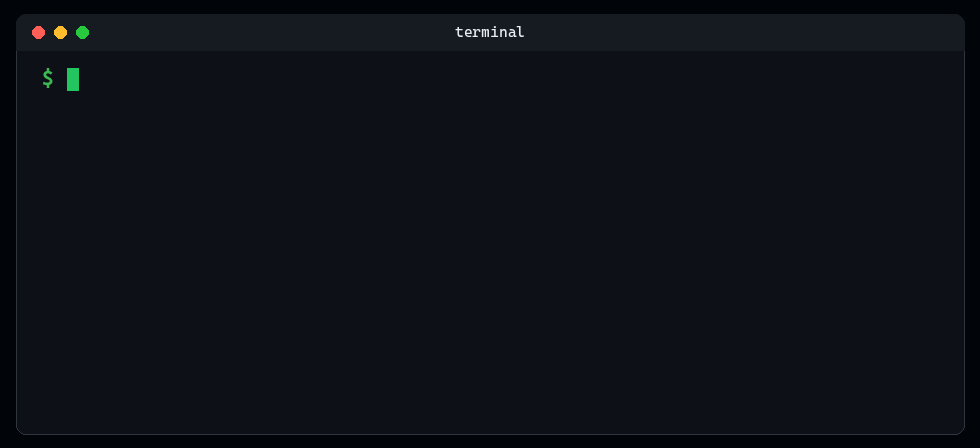

<!-- LANGUAGE-SELECTOR-START -->
🌐 [English](../../README.md) · [العربية](../ar/README.md) · [Español](../es/README.md) · [हिन्दी](../hi/README.md) · **Italiano** · [日本語](../ja/README.md) · [한국어](../ko/README.md) · [Português (Brasil)](../pt/README.md) · [Русский](../ru/README.md) · [简体中文](../zh-CN/README.md)
<!-- LANGUAGE-SELECTOR-END -->

<div align="center">

</div>

<div align="center">

# EGC - Dai a ogni agente AI lo stesso cervello

**Memoria persistente condivisa automaticamente da ogni agente AI, IDE, terminale e sessione. Nessun prompt da memorizzare. Nessun contesto da ricostruire. Basta parlare.**

</div>

---

EGC non è un altro strumento di memoria. È il livello di intelligenza che permette a ogni AI di lavorare come se fosse nel tuo progetto dal primo giorno, in Cursor, Copilot, Claude Code, Codex, Aider e in qualsiasi agente da terminale (20 strumenti di coding AI in totale). Funziona in modo nativo con Claude, GPT-4o, Gemini, DeepSeek, Mistral, Groq, Cohere e Vertex AI, oltre a OpenRouter per Qwen3, Llama 4 e altri.

Ogni conversazione costruisce l'intelligenza collettiva del tuo progetto. Ogni agente la eredita. Ogni sessione diventa più intelligente.

---

## Installazione

```bash
npm install -g @egchq/egc && egc install
```

- **Riduci fino al 90% lo spreco di contesto, taglia i costi dei token e mantieni ogni AI perfettamente allineata tra le sessioni.**
- **Guardian: valida ogni comando prima dell'esecuzione, blocca scritture pericolose e rileva prompt injection. Ogni cervello condiviso include un livello di sicurezza integrato.**
- **Un comando, zero configurazione: la memoria resta locale e cifrata sulla tua macchina, e non viene mai committata su git.**

<div align="center">
  
</div>

[Guida completa all'installazione](../../docs/installation.md)

---

## Dentro il cervello: come funziona EGC

EGC non è una lista di strumenti, è un cervello con più facoltà. Ricorda, comprende, protegge, filtra e coordina, su ogni agente AI della tua macchina.

<div align="center">
  
</div>

### Non memorizzi comandi, parli in modo naturale

Parla al cervello in qualsiasi lingua: "salva questa sessione", "cosa abbiamo deciso sull'auth?", "ricorda questa decisione". EGC capisce l'intento, salva il contesto e lo richiama all'istante in qualsiasi altra scheda, terminale o strumento sulla tua macchina. Un cervello. Ogni agente. Zero comandi da ricordare.

### Memoria persistente di progetto

EGC dà a ogni agente AI un cervello persistente e condiviso. Cattura decisioni, contesto di sessione, memoria di lavoro e pattern appresi, poi li rende subito disponibili in qualsiasi altro terminale, IDE o agente che apri. Stato della sessione, cronologia di progetto e lezioni accumulate scorrono in modo continuo tra schede, strumenti e compagni di team: nessuna sincronizzazione manuale, nessuna perdita di contesto. Tutta la memoria vive in `~/.egc` sulla tua macchina, cifrata con AES-256-GCM, separata per branch di progetto, e non viene mai committata nel repository.

### Guardian: guardrail di sicurezza integrati

Una seconda metà del cervello esegue guardrail in background. Valida i comandi prima dell'esecuzione, blocca scritture rischiose, comprime il contesto prima che si saturi, orchestra task multi-step tra agenti e apprende da ogni correzione, tutto senza che tu debba invocare un solo strumento. Una rete di sicurezza invisibile che mantiene il contesto leggero, le azioni sicure e i workflow autonomi.

### Token Crusher: il cervello filtra il rumore prima di ricordare

Il cervello non ricorda soltanto, filtra. Prima che qualsiasi output della shell raggiunga il modello, il Token Crusher di EGC comprime git log, rumore dei test, spam di installazione e JSON enormi fino al 90%, preservando ogni errore e avviso. Basta chiedere "quanto ho risparmiato?" in qualsiasi lingua, e la risposta arriva direttamente dal tuo ledger locale a costo zero: sessioni più economiche, contesto che dura.

---

## Libreria di prompt

Come bonus, EGC ti dà accesso a 63 agenti, 230 skills e 77 commands, più 111 regole: specialisti che revisionano il tuo codice in autonomia, guide alle best practice per ogni linguaggio e situazione, scorciatoie che eseguono intere sequenze di task per te, e regole di stile che mantengono il codice coerente. Tutto scritto da sessioni reali di ingegneria, non da teoria. Non vuoi usare nulla di questo? Nessun problema: la memoria persistente di EGC funziona esattamente allo stesso modo.

---

## Avvio rapido

Non esiste un passo due. Apri qualsiasi tuo strumento AI e parla: "ciao", "continuiamo", "ricorda questa decisione", in qualsiasi lingua. Le sessioni si connettono subito, la memoria si carica automaticamente, e ogni scheda aperta sa già cosa stanno facendo le altre: due schede Cursor, un terminale Claude Code e una sessione Antigravity condividono lo stesso contesto vivo, simultaneamente.

Una dashboard live che mostra attività degli agenti, token e costi si avvia automaticamente subito dopo l'installazione. Preferisci il controllo manuale? Ogni comando è documentato nella [guida all'installazione](../../docs/installation.md): probabilmente non dovrai mai digitarne uno.

---

🌐 [English](../../README.md) · [العربية](../ar/README.md) · [Español](../es/README.md) · [हिन्दी](../hi/README.md) · **Italiano** · [日本語](../ja/README.md) · [한국어](../ko/README.md) · [Português (Brasil)](../pt/README.md) · [Русский](../ru/README.md) · [简体中文](../zh-CN/README.md)

---

## Supporta EGC

EGC è creato da un solo sviluppatore, mantenuto in modo aperto e gratuito.

- **[Website](https://fmarzochi.github.io/EGCSite)**: documentazione completa, panoramica delle funzionalità e demo live
- **[Unisciti al Discord](https://discord.gg/TxppsGb52)**: fai domande, condividi feedback
- **[Sponsorizza su GitHub](https://github.com/sponsors/Fmarzochi)**: qualsiasi importo
- **[Dona via PayPal](https://www.paypal.com/donate/?business=fmarzochi%40gmail.com&currency_code=USD)**: non serve un account GitHub
- **Metti una stella al repository**: aiuta altri sviluppatori a scoprirlo
- **[Contribuisci](../../.github/CONTRIBUTING.md)**: agent, skills, commands, bug fix, documentazione
- **Condividi**: se EGC ha cambiato il tuo modo di lavorare, dillo a qualcuno

### Sponsor

Il supporto della community mantiene questo progetto vivo e indipendente.

#### Partner di strumenti

Strumenti di AI coding che si integrano in modo nativo con EGC. I partner ottengono spazio logo in tutti i README e in EGCSite.

<a href="https://www.pincushion.io/"></a>

#### Sponsor annuali · _Sii il primo sponsor annuale._

---

#### Sostenitori

<a href="https://github.com/chizormaangel-commits"></a>

#### Sponsor mensili · _sii il primo_

---

<div align="center">

[](https://www.bestpractices.dev/projects/13099) [](https://www.bestpractices.dev/projects/13099?level=baseline-1) [](https://www.bestpractices.dev/projects/13099?level=baseline-2) [](https://www.bestpractices.dev/projects/13099?level=baseline-3)

<br>

<a href="https://bestpractices.dev/projects/13099"></a>
&emsp;&emsp;&emsp;&emsp;&emsp;&emsp;&emsp;
<a href="https://www.linkedin.com/in/felipemarzochi"></a>

</div>
